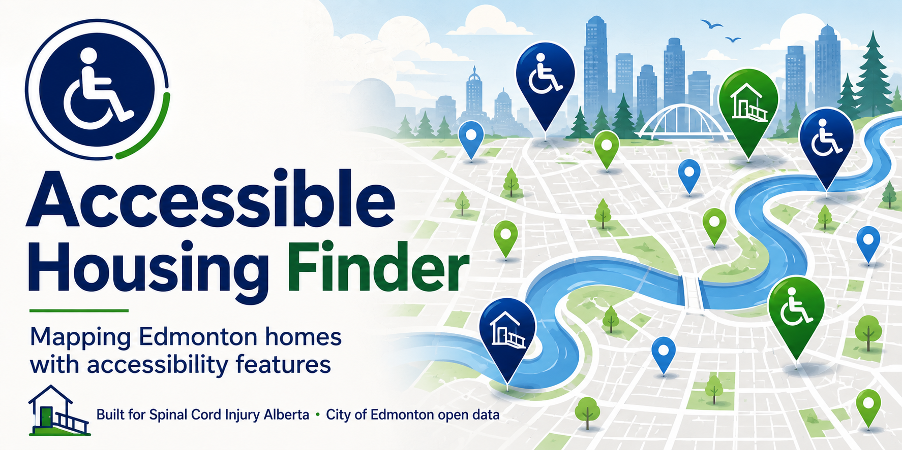

# SCIA Accessible Housing Finder



A tool that builds a database and interactive map of Edmonton properties with
**accessibility-related building work** — ramps, lifts/elevators, wheelchair
access, barrier-free features, and similar — to support
[Spinal Cord Injury Alberta](https://sci-ab.ca/)'s accessible housing work.

All data comes from the **City of Edmonton's free public Open Data** (Socrata).
No API key is required to gather the data.

## The problem

For people with spinal cord injuries and other mobility disabilities, finding
housing that is actually wheelchair-accessible or barrier-free in Edmonton is
hard. There is **no central list** of which homes have ramps, lifts, or
barrier-free bathrooms, so individuals and the organizations supporting them
often have to piece it together one listing at a time, with no way to search
for the features that matter.

Meanwhile, the City of Edmonton's public building and development permits **do**
record this work — when a ramp is added, an elevator installed, or a bathroom
made barrier-free — but that information sits buried inside large permit datasets
that were never designed to answer the question "where is the accessible
housing?"

## How this helps

This project mines those public permit records for accessibility-related work,
narrows the results to homes, pins them on a searchable, filterable map, and
shows a Street View photo of each one. It turns scattered permit data into a
**browsable starting point** that Spinal Cord Injury Alberta and the people it
serves can use to find and track accessible housing across the city.

## In plain language

We built a free, online map that shows Edmonton homes that have had
accessibility-related work done — things like wheelchair ramps, lifts, and
barrier-free bathrooms. There's no existing list of accessible homes, but the
City of Edmonton's public building records (going back to 2009) quietly capture
this work — so we pulled it out and put it on a map. You can open it in any web
browser, click any dot to see the address and what work was done, and even view
a street-level photo of the property. It's a starting point to help us find and
track accessible housing across the city. One thing to keep in mind: it's an
early draft pulled automatically from city data, so a few entries may not be
true accessibility features (for example, a "ramp" that's actually a
parking-garage ramp) — we'll refine the list over time.

## 🗺️ Live map

**[View the interactive map →](https://jcrossman.github.io/SCIA-Accessible-Housing-Finder/)**

No setup needed — just open the link. Click any dot for the address, the
accessibility work done, permit history, and a Street View photo. Use the
**Map / Satellite** toggle (top-left) to switch to satellite imagery, and the
**Filter** panel to narrow by feature (ramps, lifts, wheelchair access,
step-free entries, or general barrier-free work) and by **permit year**.

## What it produces

- **An interactive map** (`data/edmonton_accessibility_map.html`) — open in any
  browser. Each dot is a property; click it for the address, neighbourhood,
  what accessibility work was done, permit counts, dates, and a Street View
  photo of the front of the building.
- **Spreadsheets (CSV)** you can open in Excel — see [Data files](#data-files).

## Results at a glance

| Step | Result |
| --- | --- |
| Building permits mentioning accessibility | 1,429 |
| Development permits mentioning accessibility | 305 |
| Narrowed to residential (homes) | 299 building + 121 development |
| Combined into unique addresses | **355 properties** |
| Geocoded / mappable | **324 (91%)** |
| Could not be auto-located (for manual review) | 31 |

**Data coverage:** building permits from **2009**, development permits from
**2015**, both through the present — the full span the City of Edmonton
currently publishes (no date filter is applied). Coverage is not uniform across
those years: older permits less often use modern terms like "barrier-free," so
recent years are over-represented.

> **Caveat — keyword false positives.** A word like "ramp" sometimes refers to a
> *parking-garage* ramp rather than a wheelchair ramp. Each record keeps its full
> permit description so these can be reviewed and filtered.

## Data sources (City of Edmonton Open Data)

| Dataset | ID | Used for |
| --- | --- | --- |
| General Building Permits | `24uj-dj8v` | Construction/renovation records |
| Development Permits | `2ccn-pwtu` | Land-use/development approvals |
| Parcel Addresses | `ut27-nrpn` | Address → latitude/longitude (geocoding) |

## Data files

| File | Contents |
| --- | --- |
| `data/edmonton_building_permits_accessibility.csv` | All building-permit matches |
| `data/edmonton_development_permits_accessibility.csv` | All development-permit matches |
| `data/edmonton_building_permits_accessibility_residential.csv` | Residential-only building permits |
| `data/edmonton_development_permits_accessibility_residential.csv` | Residential-only development permits |
| `data/edmonton_accessibility_residential_merged.csv` | **Master list** — 335 unique addresses, deduped, with coordinates |
| `data/edmonton_accessibility_unmatched_addresses.csv` | The 25 addresses needing manual location lookup |
| `data/edmonton_accessibility_map.html` | The interactive map |

## How to re-run / refresh the data

Requires Python 3.9+ and the `requests` library.

```bash
pip install -r requirements.txt

# 1. Query Edmonton Open Data and write the raw + residential CSVs
python scripts/edmonton_accessibility_query.py

# 2. Merge residential building + development permits into one address list
python scripts/merge_residential_accessibility.py

# 3. Fill in coordinates from the Parcel Addresses dataset
python scripts/geocode_residential_accessibility.py

# 4. (optional) Export the addresses that couldn't be geocoded
python scripts/export_unmatched_addresses.py

# 5. Build the interactive map
python scripts/generate_accessibility_map.py
```

All scripts read/write the `data/` folder.

## Using the map

1. Open `data/edmonton_accessibility_map.html` in a browser.
2. Click **Enter Google key to load map**, paste your Google Maps API key once
   (it is stored in your browser only — never committed or shared).
3. Click any dot to see the property details and a Street View photo.

**Accessible alternative:** because an interactive pin map is hard to use with a
keyboard or screen reader, the panel includes a **"View as list"** button that
opens a keyboard- and screen-reader-friendly text list of the same homes
(address, features, years, and a link to each in Google Maps / Street View). The
list reflects whatever filters are active.

The map uses the **Google Maps JavaScript API**, so the key needs both of these
enabled in the [Google Cloud Console](https://console.cloud.google.com/):

- **Maps JavaScript API** (to display the map)
- **Street View Static API** (for the in-popup photos)

Google's recurring free monthly credit covers far more usage than this project
generates, so in practice it stays within the free tier.

## Keywords searched

`ramp`, `wheelchair`, `accessible` / `accessibility`, `barrier-free`,
`grab bar`, `lift` / `elevator`, `mobility`, `handicap`, `universal design`,
`ada compliant`.

## Notes

- Results reflect what the City currently publishes (a rolling window of recent
  years), so re-running refreshes the numbers.
- The published map uses a **public browser key** in `data/config.js`, which is
  restricted to this site's domain and capped by daily quotas (a Maps
  JavaScript key is public by design — see the alignment notes below). For
  local or private use you can instead enter a key via the in-map button, which
  is stored only in your own browser.

## The Open State alignment

This project is built under **[The Open State](https://github.com/JCrossman/the-open-state)**
and is governed by its
**[Constitution](https://github.com/JCrossman/the-open-state/blob/main/CONSTITUTION.md)**
at tag **`constitution-v1.1`**.

**What it is — and what it is not.** The Open State's Civic Access Protocol is
designed for *transactional assistive technology*: tools that act inside a
citizen's own authenticated session to complete an action (a booking, a payment,
a submission). This project is a different shape — a **read-only discovery
tool**, a public map built from open data. It has no citizen login, no session,
no credentials, and takes no consequential actions. It therefore makes **no
claim of full Civic Access Protocol compliance**, and it deliberately does
**not** use `@open-state/kit` (the `vault` / `confirm-gate` / `capture`
primitives) — those exist for the session and credential articles that do not
apply here.

**The articles it lives by:**

- **Art. 3 — Accessibility is the purpose.** Accessibility is the whole point,
  not a feature. Accessibility attributes are surfaced as first-class and are
  **filterable**, so a citizen can restrict the map to the features they need.
- **Arts. 5 / 6 — Minimization & no exploitation.** It collects no citizen
  data, is not monetized, and sells nothing.
- **Art. 7 — Honesty about limits.** It separates what is verified from what is
  assumed (see the caveats below and on the map itself).
- **Art. 8 — Openness.** Public, MIT-licensed, and forkable, so the method can
  be reused for the next service.

### Honest notes and known limits

*Recorded rather than hidden (Constitution Art. 7):*

- **Permits are not availability, and not proof of current accessibility.** A
  permit shows accessibility work was approved or done at some point; it does
  not mean the home is still accessible, or is for sale or rent today. Treat
  every pin as "worth checking," not as fact.
- **Third-party dependency, against the movement's usual grain.** The map uses
  **Google Maps and Street View** (and loads a clustering library from a CDN).
  Google is a third party that meters and can profile usage, which runs against
  The Open State's preference for no third-party trackers or CDNs (Art. 6). This
  is a **deliberate trade-off**: Street View's coverage is uniquely valuable for
  judging a property from the street, and no open alternative matches it today.
  The browser key is public by design but is **restricted to this site's domain
  and capped by daily quotas**. A privacy-respecting, self-hosted map stack is a
  known future option (it would cost the Street View feature).
- **Keyword false positives.** Substring matches like "ramp" / "lift" can catch
  parking-garage ramps or freight lifts. Full permit text is kept in every
  record so a human can judge.
- **Geocoding coverage is ~91%.** The remainder are listed in
  `data/edmonton_accessibility_unmatched_addresses.csv` for manual lookup.

### The genuine Civic Access Protocol piece is the next layer

The map is the *discovery* front door. The point where The Open State's protocol
truly applies is the planned **availability / application-assist** step (see
[issue #2](https://github.com/JCrossman/SCIA-Accessible-Housing-Finder/issues/2)):
helping a citizen *act* — check a listing or navigate a housing application —
inside their own session, at their direction. That layer should adopt
`@open-state/kit` and meet Articles 1, 2, 9, and 10 in full.
